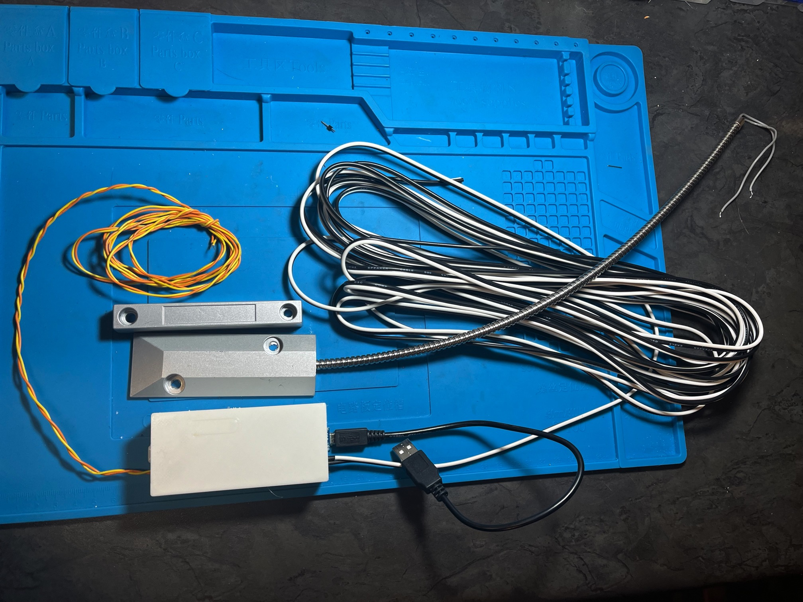
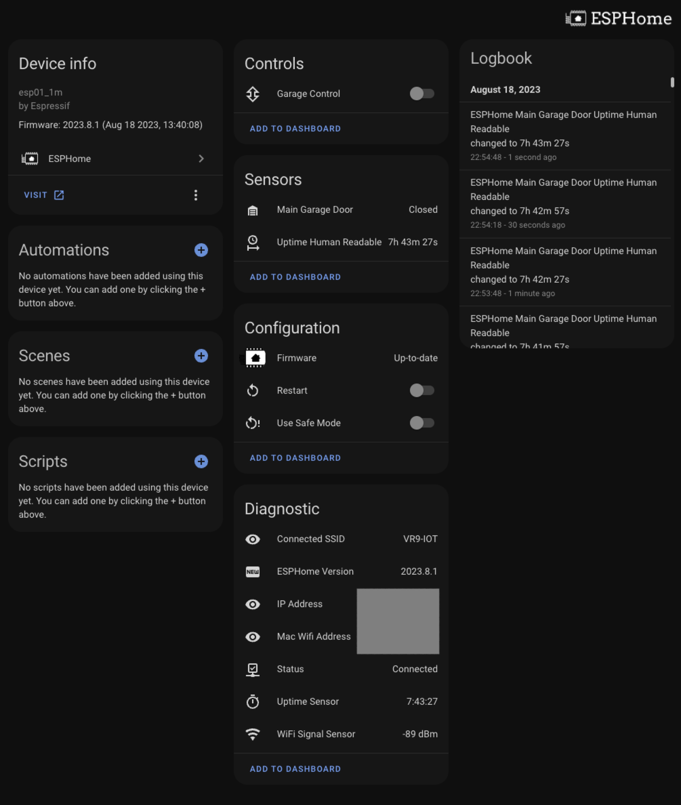
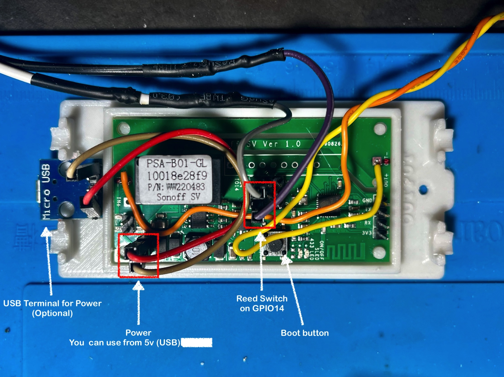
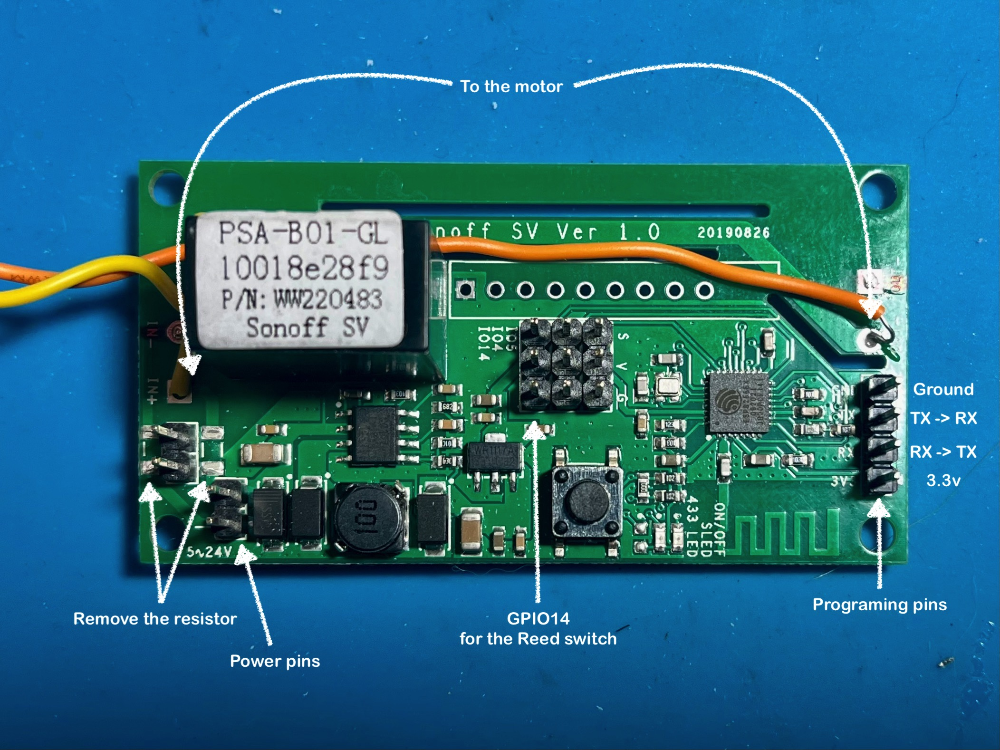
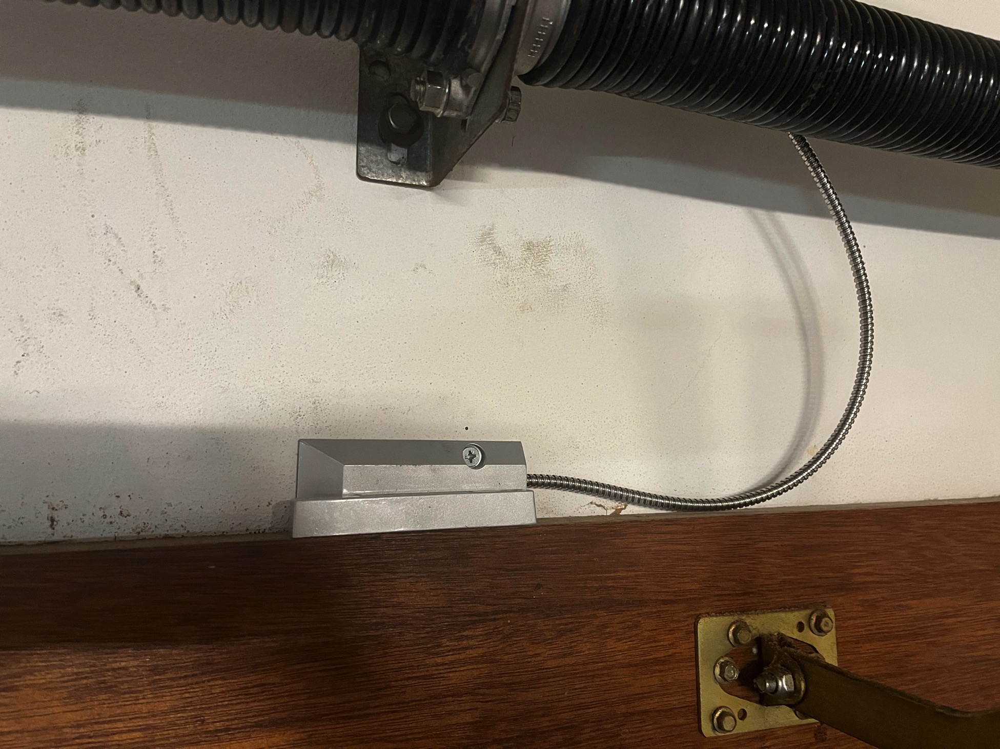
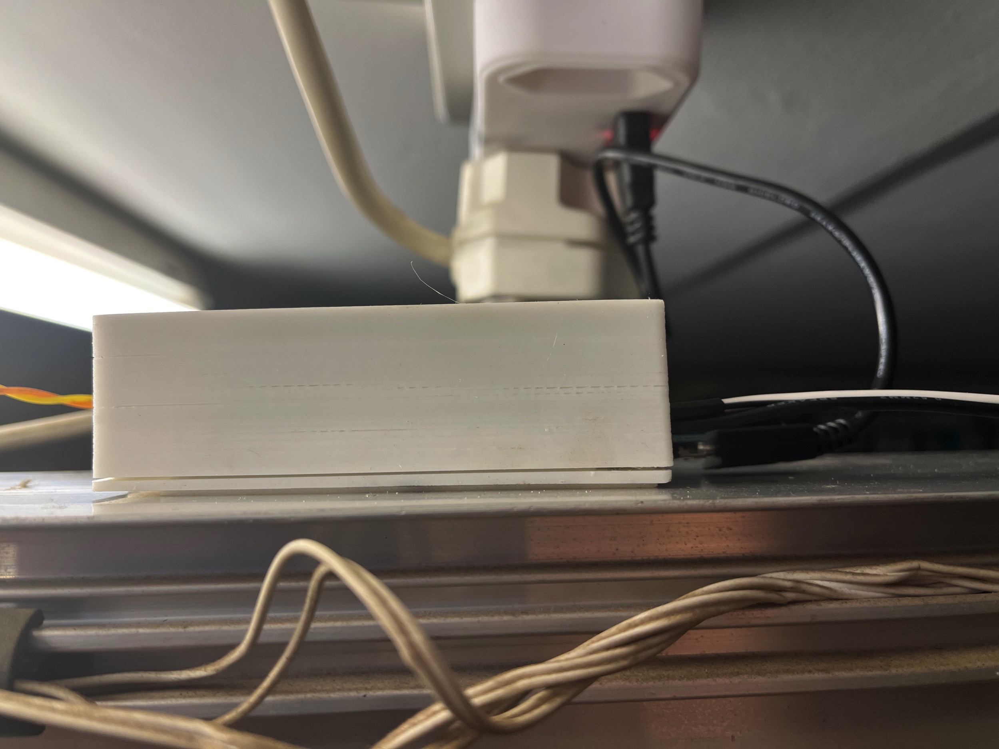
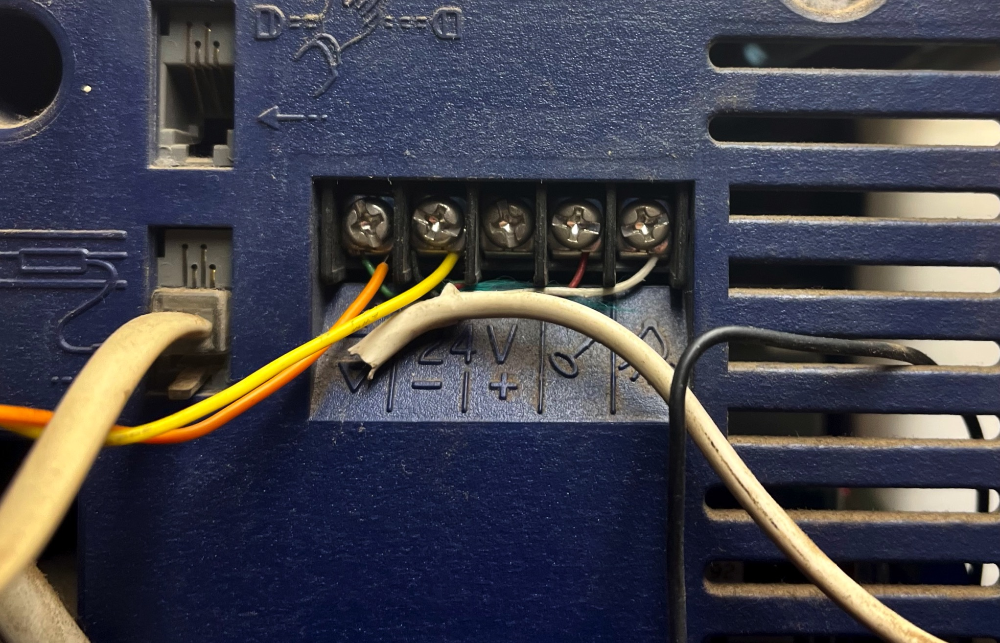
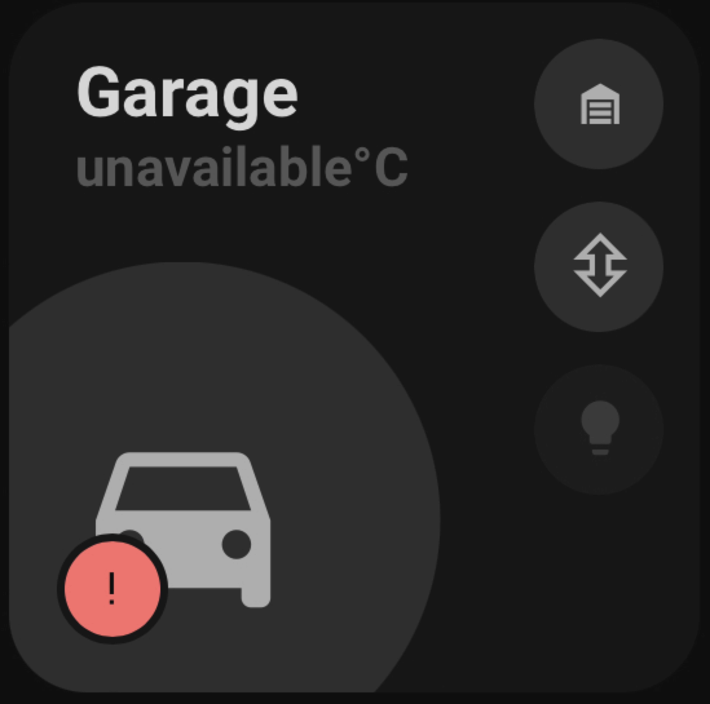
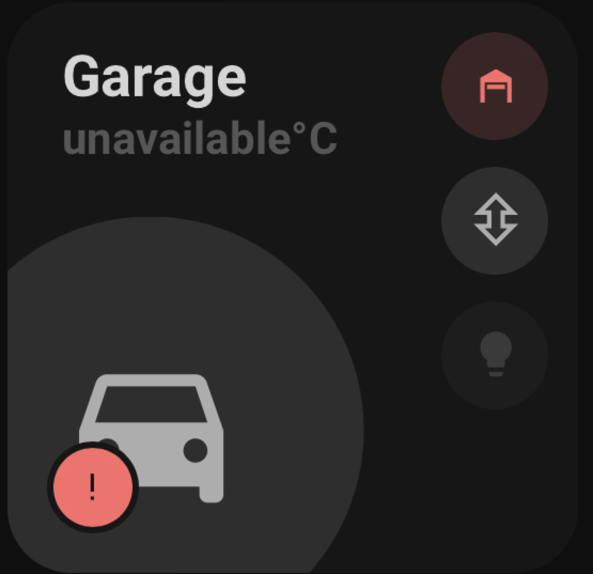

# ESPHome Garage Controller

## Warning!

This example code is supplied **"as is"** with no warranties of any kind, it works on my setup but it des not mean it will work on yours without modifications or at all. This example is meant to point you in the right direction. I take no responsibilities on it's usage. 
I've tried to document it sufficiently that it is readable and easy to understand.

## History

Amongst the many things I wanted to smartify was my garage door, why? If you knew the number of times my wife asked me if we had closed the garage door halfway to our destination, you'd understand.
The hardware is based on [Dr Zzs](https://youtu.be/QMepwpyjMCY) but he uses Tasmota, I just wrote the ESPhome version for it.

## Assumptions

- You are willing to get your hands dirty, this means a some code and some electronics assembly, but since you are using Home Assistant I guess you knew that already.
- You have a Home Assistant sever that is configured with your inverter of choice.
- You know how to map your Home Assistant server configuration folder via Samba.
- You have used ESPHome before.

## What will you need?

**Please note that links are given for reference only and are not affiliate!**

* A Sonoff SV  
  [South Africa - Eiferer](https://eiferer.co.za/products/sonoff®-sv-inching-self-locking-wifi-wireless-switch-5v-24v) -
  [AliExpress](https://www.aliexpress.com/item/4001131764434.html)  
* A FTDI USB To TTL Module  
  [South Africa - PiShop](https://www.pishop.co.za/store/geekcreit-ft232rl-ftdi-usb-to-ttl-serial-converter-adapter-module?keyword=usb%20programmer&category_id=0) - 
  [AliExpress](https://www.aliexpress.com/item/32273550144.html) - [Amazon](https://www.amazon.com/WWZMDiB-FT232RL-Converter-Adapter-Breakout/dp/B0BJKCSZZW/?adgrpid=81891463152&hvadid=585362629887&hvdev=c&hvlocphy=1028632&hvnetw=g&hvqmt=b&hvrand=977913646945187746&hvtargid=kwd-298938143740&hydadcr=20753_13331633)
* Some wires, 2 different colors would be preferable
* A Reed switch  
  [South Africa - PiShop](https://www.pishop.co.za/store/zinc-alloy-alarm-garage-windowrolling-door-reed-switch?keyword=reed&category_id=0) - 
  [AliExpress](https://www.aliexpress.com/item/32933262677.html) - 
  [Amazon](https://www.amazon.com/uxcell-Security-Rolling-Contact-Magnetic/dp/B07F5WKS4N/?crid=FRMK7WT0C9ZD&sprefix=reed+switch+garage,aps,407&th=1aliex)
* A long cable
* A container for the Sonoff SV, I printed mine from [Thingiverse](https://www.thingiverse.com/thing:3459812)

## The Code

You will find the ESPHome code [here](ESPHome/esphome-garage-door-controller.yaml)

To install it, you will need a FTDI USB to TTL module, connect it as follows:
- FTDI VCC to Sonoff SV 3V3 **but first make sure your FTDI is set to 3.3v, you may damage the Sonoff SV if it is not!**
- FTDI TX to Sonoff SV RX
- FTDI RX to Sonoff SV TX
- FTDI GND to Sonoff SV GND

Press the boot button, keep it pressed and connect it to your PC, once it has power release the button, it is now in programming mode.

Go to ESPHome copy my code, add your static IP and WiFi details and install it.  
Once finished, disconnect the Sonoff SV and reconnect it, it should now appear as connected in ESPHome.  
If it does not appear in ESPHome, rinse and repeat.

If it appear in ESPHome but not in Home Assistant, add it manually by using the IP you assigned to it.

You will end up with this

## Assembly Diagram

  
Image 1  
  
Image 2  

The assembly is as follows:
1. Make a cable with 2 wires long enough to reach where you want to mount it to your garage door.
2. Connect GPIO14 to one side of the reed switch and the other to ground, the reed switch will open or close the loop and report the door open or close. [Image 1/2]
3. Remove the resistors as shown on Image 2, this will isolate the ESP from the switch, **this is important!**
4. Connect or solder a wire to the IN+ and the OUT+ as shwown in image 2 
   Don't do like me, get distracted and solder the wrong ones and then wander why things do not work, see Image 1, I felt silly. 
5. Prepare the power as shown in image 1, but do not connect it yet!

At this point you are ready to install the controller to your door, just ensure you have enough wire to reach everywhere, to the reed switch as well as the motor. I mounted my controller box near my motor and installed a duct along the rail for the reed switch.

### Installation

The reed switch should be installed on the garage door, the magnet on the door and the sensor on the wall facing each other as shown bellow

The box containing the Sonoff SV should be as close to the motor as possible

For testing purposes, mine is powered by USB but I will switch it over to the garage door 24v DC in the near future.

Though my motor is now over 20 years old it was an easy connection to do, one wire connected to -24V (ground) and one to the trigger, note that it does not matter which cable you chose for which connector.   
Make sure the wired remote is still connected though, we are installing a parallel mechanism so it can still be controlled manually should the Sonoff SV fail to function. This is also in keeping with the if the automation fails everything still functions the old way, aka manually. 

Now you are ready to integrate it into your dashboard, here is mine.

| Garage Closed                                                 | Garage Open                                                 |
| ------------------------------------------------------------- | ----------------------------------------------------------- |
|  |  |

## What is next?

Some automation and notifications to tell we have left the door open when we leave and if it's open too long.
I'll add them to the Home Assistant folder in the future.

## Sponsoring

 If you like my work and want to support the growth of the project, you can! 

[![Buy Me A Coffee][2]][1]

[1]: https://www.buymeacoffee.com/parentpj
[2]: https://cdn.buymeacoffee.com/buttons/default-black.png