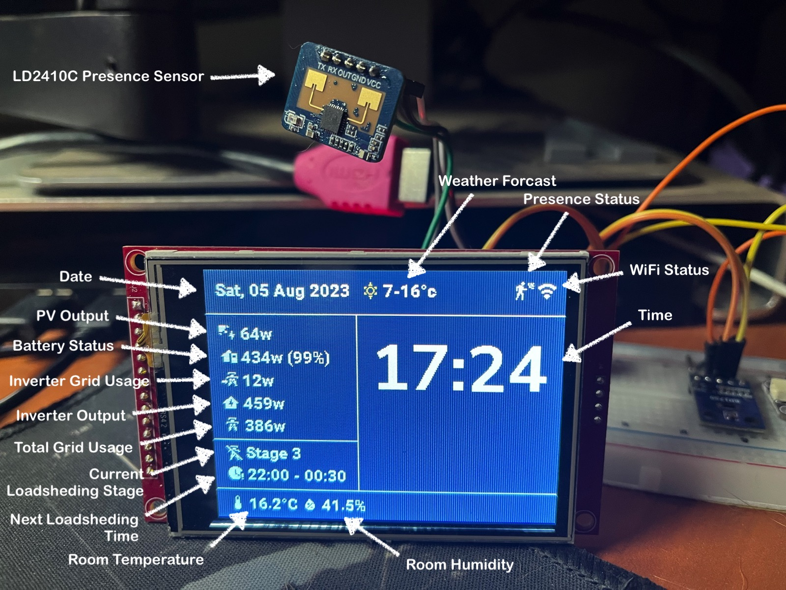
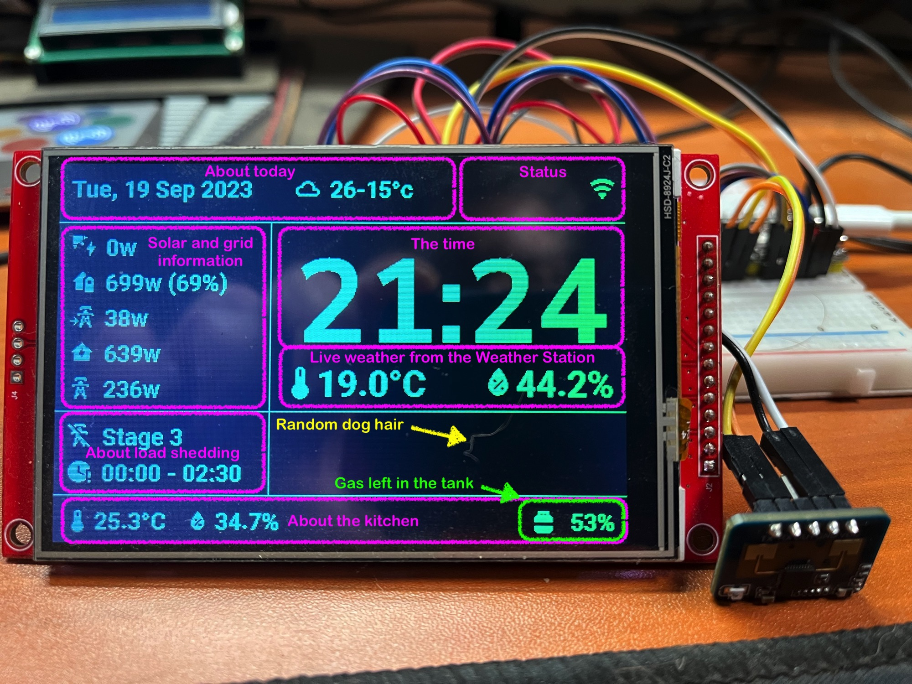

# ESPHome Energy Display

***Note: This project is in active development!***
### ESP32 S with a 240*320 ILI9341 3.2in screen

### ESP32 S3 with PSRAM with a 480*320 ILI9488 4in screen

## Warning!

This example code is supplied **"as is"** with no warranties of any kind, it works on my setup but it des not mean it will work on yours without modifications or at all. This example is meant to point you in the right direction. I take no responsibilities on it's usage. 
I've tried to document it sufficiently that it is readable and easy to understand.

## History

My wife and I needed a way to monitor our solar setup and our load shedding schedule to optimize our power usage.
The idea is to use power hungry appliances when we are generating a maximum with the solar panels but not when we are load shedding.
Since this display is to be mounted in the kitchen, I threw everything and the kitchen sink at it.

## Assumptions

- You are willing to get your hands dirty, this means a some code and some electronics assembly, but since you are using Home Assistant I guess you knew that already.
- You have a Home Assistant sever that is configured with your inverter of choice.
- You know how to map your Home Assistant server configuration folder via Samba.
- You have used ESPHome before

## The bill of materials

### ESP32 S with a 240*320 ILI9341 screen
* ESP32, I used a NodeMCU ESP32S Development board, but any ESP32 would work, you'll need to readjust the pins accordingly.
* A 10uf capacitor to force the ESP32 into programing mode, this is only required for the first upload.
* Some Jumpers.
* A breadboard
* TFT SPI Touchscreen - I used a 3.2in 240*320 ILI9341. Please do not try to use a ILI9488, from what I gather ESPHome is not yet compatible with it.
* A suitable USB cable for your ESP32

### ESP32 S3 with PSRAM with a 480*320 ILI9488 screen
* ESP32 S3, I used a ESP32 S3 Development board.
* Some Jumpers.
* A breadboard
* TFT SPI Touchscreen - I used a 4in 480*320 ILI9488.
* A suitable USB cable for your ESP32

Optionally:

- SHT40 Temperature and humidity Sensor.
- GY-302/BH1750 Light Sensor, is there enough light to start cooking? No? Switch them on! This would require a smart switch (HA Implementation coming soon).
- LD2410C MMwave Sensor for presence detection.
- MQ2 Gas/Smoke Sensor, in case something starts burning.

Additional optional sensor devices:
- An ESP with an MQ-6 sensor to house with the bottle for LPG leaks, see mine [here](../LPG%20Gas%20Leak%20Sensor/README.md)
- A Gas Eye Pro / Mopeka Pro Check for the gas bottle capacity
- A weather station on your house, see mine [here](../Weather%20Station/README.md)

## Assembly Diagram

--> Assembly diagram and instructions coming soon <--

## Minimum Dependencies

You will also need a Home Assistant installation to get some of the data.
The required HA integrations are:
* ESPHome
* Eskom Loadshedding Interface, you'll need to install HACS for this one, there are plenty tutorials on line for this. Installation instructions are [here](https://github.com/swartjean/ha-eskom-loadshedding)
* An electricity mains integration, I had an old Efergy device which did the trick though I may move to a custom built ESPHome solution or a Shelly EM
* An integration into your inverter to get solar production, battery states, house power consumption, ... On my Sunsync, I currently use a HA addon by a fellow South African called "[Sunsynk/Deye Inverter Add-on (multi)](https://kellerza.github.io/sunsynk/)". If you follow the instructions to the letter, it works. Just make sure the USB-to-RS485 adapter you purchase has a ground. I am looking at using an ESP32 for this in the future as a dedicated HA instance with a Raspberry Pi is not cost efficient.
* An integration into your favorite weather data supplier,  I use OpenWeatherMap but I guess any other will work with a little bit of code tweaks on the ESPHome and Home Assistant configurations.

## Next step

1. You get your hands dirty, first you will need to add a few blocks of code in the Home Assistant configuration, check the Home Assistant folder, a Configuration.yaml file has everything you need. Note that you may need to adjust some entity_ids to match your configuration.

2. Get the material icon truetype font file from [here](https://github.com/material-icons/material-icons-font/tree/)master/font
You will need to create a folder in the HA config/esphome/ folder called "font" on your HA server. To do this you may have to install the "Samba Share" add-on

3. Copy and modify the code in the esphome-energy-display.yaml 

4. Upload it to your ESP32 using USB, after this initial upload you can upload using OTA updates.

## The future

I want to add some buttons to switch appliances with Shelly devices on or off as well as the lights.

I have a gas hob and we never know when it is running out or if it is leaking. I will add the gas leak sensor and fill percentages to the screen. I'll also share the gas leak sensor code and assembly.

I will share the circuit board and the 3D printable housing here when it is designed. 

### Coming next 

- Add CO2 MQ-2 Gas/Smoke sensor to the bottom section.
- Add LPG MQ-6 sensor reading to the bottom section.
- Add Sonar Tank BLE Sensor (Mopeka Pro) reading to the right bottom section.

## Change log

#### 4 Aug 2023
- Added MmWave Presence Sensor 
- Added Presence icon on the left of the WiFi icon. 
- Moved Time to the right area.
- Remove CO2 and TVOC from bottom bar and removed the sensor section.
- Cleaned up YAML file and added some comments.

#### 5 Aug 2023
- Removed WebServer.
- Added Bluetooth Proxy section.
- Added BLE Tracker section.
- Added Mopeka Pro Check in the Sensor section.
  - To add this as a sensor please read this [page](https://esphome.io/components/sensor/mopeka_pro_check.html?highlight=mopeka) in the ESPHome documentation.

#### 19 Sept 2023
- Added the ESP32 S3 with a 4in 480x320 ILI9488 screen configuration file

## Sponsoring

If you like my work and want to support the growth of the project, you can! 

[![Buy Me A Coffee][2]][1]

[1]: https://www.buymeacoffee.com/parentpj
[2]: https://cdn.buymeacoffee.com/buttons/default-black.png