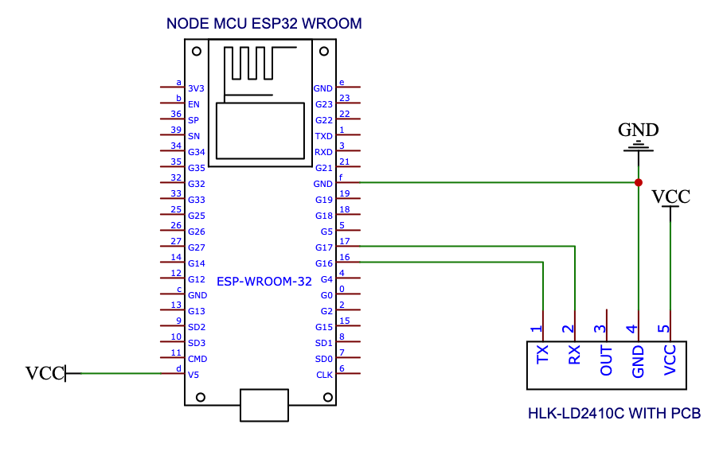

# ESPHome LD2410C MMWave Module

## Warning!

This example code is supplied **"as is"** with no warranties of any kind, it works on my setup but it des not mean it will work on yours without modifications or at all. This example is meant to point you in the right direction. I take no responsibilities on it's usage. 
I've tried to document it sufficiently that it is readable and easy to understand.

## Summary

I wanted to use a more accurate presence sensor to trigger some lights around the house.
PIR does not work well in offices where people barely move and the same goes for lounges and bathrooms.
I looked at some off the shelf products but they were prohibitively expansive, see the Aqara PF1 sensor for example.

Enters the LD2410 MMWave module, the LD2410C is about ZAR130 at the time of writing and an ESP32 D1 Mini will set you back about the same.
Add some solder, a couple of wires, ESPHome and voila, one reliable radar sensor.

## What will you find here?

***The wiring diagram*** 

***The code***

esphome-ld2410c-mmwave.yaml

Most of it is best practices and the rest is straight from the ESPHome site https://esphome.io/components/sensor/ld2410.html

##Why can't I get it work?

You will see my code UART does not use the standard GPIO1 and GPIO3, I never got it to work on those pins.
Instead, I use GPIO16 (RX) and GPIO17 (TX), that solved all my issues.
Interestingly, the ESP32 has 3 UART, more on this here: https://docs.espressif.com/projects/esp-idf/en/latest/esp32/api-reference/peripherals/uart.html
