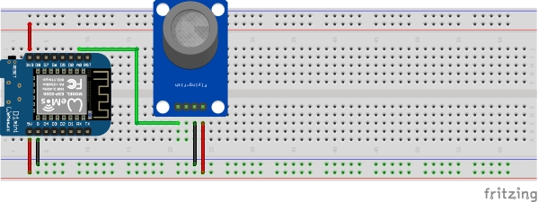

# ESPHome LPG Gas Leak Sensor

## Warning!

This example code is supplied **"as is"** with no warranties of any kind, it works on my setup but it des not mean it will work on yours without modifications or at all. This example is meant to point you in the right direction. I take no responsibilities on it's usage. 
I've tried to document it sufficiently that it is readable and easy to understand.

## History

When we installed our gas hob we were forced to put the bottle inside the kitchen, neither I or my wife liked the idea of having an LPG bottle in the kitchen without a gas sensor.
So I whipped one up, it's not completed but it does the trick.

## Note

You will need to put the sensor at the bottom of the bottle as LPG is heavier that air.

## Assumptions

- You are willing to get your hands dirty, this means a some code and some electronics assembly, but since you are using Home Assistant I guess you knew that already.
- You have a Home Assistant sever that is configured with your inverter of choice.
- You know how to map your Home Assistant server configuration folder via Samba.
- You have used ESPHome before.

## What will you need?

**Please note that links are given for reference only and are not affiliate!**

* An ESP8266 or an ESP32
  - ESP8366 [South Africa - Eiferer](https://eiferer.co.za/products/d1-mini) -
  [AliExpress](https://www.aliexpress.com/item/1005005219910629.html) - 
  [Amazon](https://www.amazon.com/dp/B08H1YRN4M/?th=1)
  - ESP32 [South Africa - Eiferer](https://eiferer.co.za/products/sonoff®-sv-inching-self-locking-wifi-wireless-switch-5v-24v) -
  [AliExpress](https://www.aliexpress.com/item/32816117396.html) - 
  [Amazon](https://www.amazon.com/dp/B08H1YRN4M/?th=1)
* An MQ-6 LPG, Butane and Propane sensor  
  [South Africa - DIY Electronics](https://www.diyelectronics.co.za/store/gas/1302-mq-6-gas-sensor-module-lpg-butane-propane.html?search_query=MQ-6&results=41) - 
  [AliExpress](https://www.aliexpress.com/item/1005002891657821.htm) - 
  [ebay](https://www.ebay.com/itm/295802217216?hash=item44df2fa300:g:VL8AAOSw0GJhfMOB&amdata=enc%3AAQAIAAAAwFc2PhmhTTPy4EUNKLRnm2bUrWzxeFUXqmRy8riVTqd84BjzbJ5Hth2WN8YHnjA0VJtGYi6%2F%2FPqstVTToFxQ43q2XM5%2FdpyrVGp2xxtHt8ixg7Spx5IxxRtsp2KCb6eH96jTa1e7K5FeTgNYwajnwPoa1a0ydop7P0iyqGNbxh3BMUpeoiC9%2FNsT8TnH20FggNgLR02wvqXGmJxjUcs7GmrKRJNt%2F2Ge5BTvF5wHgvyteSFAkQ%2B3DygMzYmp6pW7Cg%3D%3D%7Ctkp%3ABk9SR8KF_rLCYg)
* Some wires

## Circuit Diagram

## The Code

You will find the ESPHome code [here](lpg_gas_leak_sensor.yaml)

If it appear in ESPHome but not in Home Assistant, add it manually by using the IP you assigned to it.

## What is next?

I need to design a case and refine the code so the calculations are more accurate.