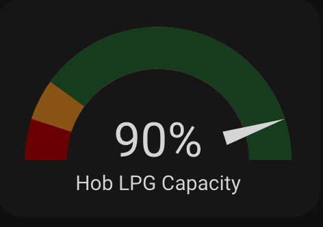

# ESPHome for Mopeka Pro Check

## Warning!

This example code is supplied **"as is"** with no warranties of any kind, it works on my setup but it des not mean it will work on yours without modifications or at all. This example is meant to point you in the right direction. I take no responsibilities on it's usage. 
I've tried to document it sufficiently that it is readable and easy to understand.

## History

2023-08-12 First commit

## About the project

I was tired of running out of gas at the most importune moments, so I looked for a solution and I came across the [Mopeka Pro Check](https://www.mopekaiot.com/product/mopeka-pro-check-sensor-aluminum-lpg-cylinders-w-collar). Though expensive, I felt it was worth the convenience to have my LPG tank level in Home Assistant with some automations to tell me that I will need to replace it soon, so I ordered one.

## What will you need?

- A Mopeka Pro Check Sensor, you can pick up one either on [Amazon](https://www.amazon.com/dp/B09J6MXJKT) or If you are in South Africa [here](https://www.eyegas.co.za/pages/residential).
- I would recommend an ESP32 for the Home Assistant integration as it will convert the Bluetooth Low Energy signal to WiFi and you can put your bottle wherever you have a WiFi signal.

## Looking for more information?

The [ESPHome page](https://esphome.io/components/sensor/mopeka_pro_check.html?highlight=mopeka) explains a lot.

## What will you find here?

***The code***

The ESPHome integration in *ESPHome/mopeka_pro_check.yaml*

#### Home Assistant code

    - type: gauge
      name: Hob LPG Capacity
      needle: true
      unit: "%"
      entity: sensor.esphome_mopeka_pro_check_lpg_level
      segments:
        - from: 0
          color: "#800000"
        - from: 10
          color: "#996719"
        - from: 20
          color: "#184B29" 

You'll get this:

## The implementation

### Option 1

As for the Home Assistant integration, you'll need to be close to you Home Assistant machine with your gas bottle and, assuming you have Bluetooth on your home Assistant machine, you will pick it up immediately in the Integration page, if not click *Add Integration* type Mopeka and see if it is on your network, if the App works, the HA integration should work too. 

If the sensor is out of the BLE range get yourself an ESP32 with Bluetooth and install ESP home on it with the following lines:

    esp32_ble_tracker:
      scan_parameters:
      interval: 1100ms
      window: 1100ms
      active: true

    bluetooth_proxy:
      active: true

Please note that you should not run the webserver with the Bluetooth Proxy, in my experience it creates an endless reboot. 

The native Home Assistant integration has its limitations, so I opted for something a little more complicated.

### Option 2

This one is a bit more complicated, the YAML code is in the mopeka_pro_check.yaml, I found the ESPHome instructions a little backwards, you will need to read it from bottom to top, the Setting Up Devices is the first thing you need to do and it's at the bottom of the [page](https://esphome.io/components/sensor/mopeka_pro_check.html?highlight=mopeka).

The code is straight forward but I found that for the South African gas bottles, often marked 11Kg the code below works better than "EUROPE_11KG":

    tank_type: custom
    custom_distance_full: 26cm
    custom_distance_empty: 1cm

Don't ask me why.
