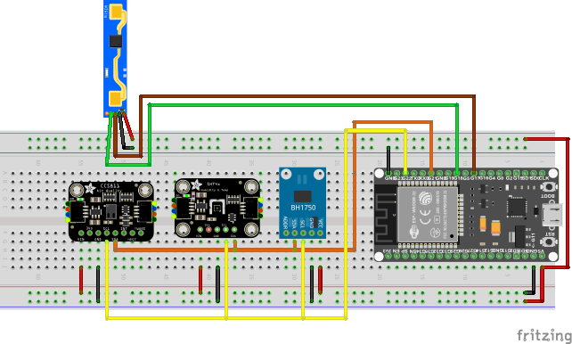

# ESPHome Standard Room Sensors

## Warning!

This example code is supplied **"as is"** with no warranties of any kind, it works on my setup but it des not mean it will work on yours without modifications or at all. This example is meant to point you in the right direction. I take no responsibilities on it's usage. 
I've tried to document it sufficiently that it is readable and easy to understand.

## History

2023-08-23 First commit

## About 

When I started out with Home Assistant and home automation it seemed the obvious choice to monitor temperature And, by extension, humidity. So I bought a few ESP-8266 and DHT22 and put myself to work. Little Did I know what came next...

So I thought now that I am monitoring temperatures and humidity, what else would be useful?
Room presence, so I added a first a PIR sensor but  I soon figured out that it did not work in my study because of my stillness when I work. So I tried the inexpensive RCWL-0516, it works including picking up the cat crossing my outside house. So I eventually found the HLK-LD2410C. The HLK-LD2410C is tunable and easy to integrate into Home Assistant using ESPHome and voila, presence detection sorted I can now control the lights and no more waisted electricity!

But wait a minute, it did not take long for me to figure out that it would come on during the day too, so I added a BH1750 Light Sensor to check if there is enough light before switching on the lights.

Well you see where this is going right?
I recently added a CCS811 Air Quality Control Sensor too, I am sure something else will turn up. 
Oh and it did, a touch screen! not for every room but strategically situated around the the house, if your are interested check this [repository](../Kitchen%20Display/README.md)

You don't have to use all the sensors but you will find diagrams and code for the lot, just delete what you are not going to use.

## Assumptions

- You are willing to get your hands dirty, this means a some code and some electronics assembly, but since you are using Home Assistant I guess you knew that already.
- You have a Home Assistant sever that is configured with your inverter of choice.
- You know how to map your Home Assistant server configuration folder via Samba.
- You have used ESPHome before.

## What will you need?

**Please note that links are of South African stores and given for reference only and are not affiliate!**

### MCU

* ESP-8266 D1 Mini Pro for the Wi-Fi only variant 
  [Micro Robotics](https://www.robotics.org.za/MINI-D1-16M-ANT)
* ESP-32 D1 Mini (or any other ESP-32) for the Bluetooth variant 
  [Micro Robotics](https://www.robotics.org.za/D1-ESP32)
* ESP32-CAM for the camera variant 
  [Micro Robotics](https://www.robotics.org.za/ESP32-CAM-OV2640)

### Sensors and other hardware

* DHT22 Temperature and Humidity Sensor
  [PiShop](https://www.pishop.co.za/store/am2302-dht22-temperature-and-humidity-sensor-module)
* SHT40 Temperature and Humidity Sensor
  [Micro Robotics](https://www.robotics.org.za/SHT-40-QWIIC)
* BH1750 Light Sensor
  [Micro Robotics](https://www.robotics.org.za/BH1750)
* LD2410C mmWave Presence Sensor
  [Micro Robotics](https://www.robotics.org.za/HLK-LD2410C)
* CCS811 Air Quality Control Sensor
  [Micro Robotics](https://www.robotics.org.za/SEN0318)
* Some wires
* A long USB cable
* A USB 5V Power supply

## Circuit Diagram

### NodeMCU ESP-32S Development Board with SHT40

Download the Fritzing file [here](fritzing/room_sensor_bluetooth.fzz)

Please note that there are no LD2410B Sensor part for Fritzing so I used the LD2410 Sensor instead but the pins are the same, RX goes to TX and TX goes to RX.

## The Code

Depending on your choice of functionality and requirements I have 3 variants of this board
1. [ESP-8266](ESPHome/room_sensor_wifi_only.yaml), no frills just does the job [I still need to test this code].
2. [ESP-32 S](ESPHome/room_sensor_bluetooth.yaml), if you need a Bluetooth proxy
3. [The surveillance ESP32-CAM](ESPHome/room_sensor_camera.yaml), I have one to keep an eye on my dogs when I am away. [Work-in-progress]

## What comes next?

I need to learn EasyEDA and Autodesk Fusion 360 to design a PCB board as well as a 3D printable housing.
Further to that, I honestly have no idea, do you? If you do leave it in the [Section].

## Sponsoring

 If you like my work and want to support the growth of this project, you can 

[![Buy Me A Coffee][2]][1]

[1]: https://www.buymeacoffee.com/parentpj
[2]: https://cdn.buymeacoffee.com/buttons/default-black.png