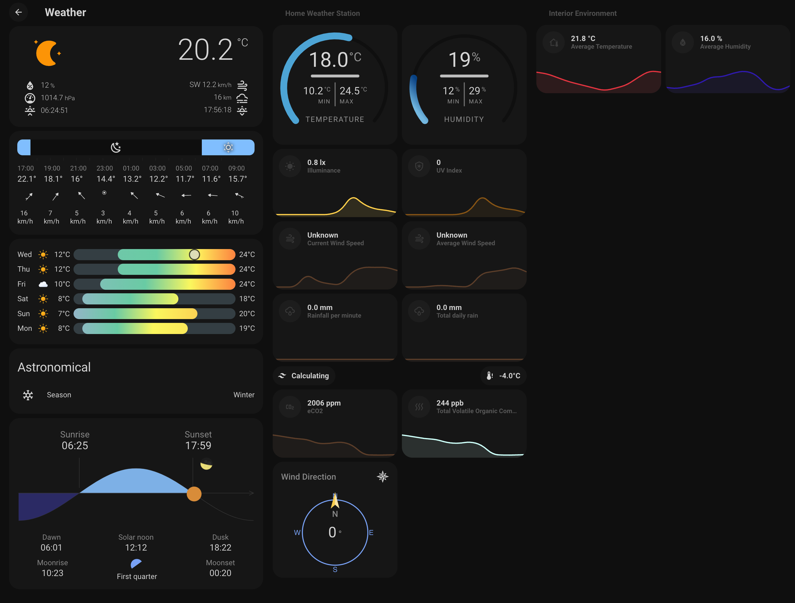

# Home Assistant Weather Dashboard for my weather station

*** Actively being developed!***

The first column is the forecast, the second is the data from the weather station and the third the interior data.

You can find the current yaml file [here](ha_weather_dashboard.yaml)
 
You will need the following Frontend elements from HACS:
- ApexCharts Card
- button-card
- Canary
- Clock Weather Card
- Compass Card
- Flexible Horseshoe Card
- Horizon Card
- Hourly Weather Card
- layout-card
- Lightning Detector Card (Future)
- Mini Graph Card
- Weather Card

And the Minimalist theme.

## History

- 2023-08-04 First beta commit.
- 2023-08-28 Updated dashboard to include horseshoe meters and cleaned up some cards

## Sponsoring

 If you like my work and want to support the growth of the project, you can! 

[![Buy Me A Coffee][2]][1]

[1]: https://www.buymeacoffee.com/parentpj
[2]: https://cdn.buymeacoffee.com/buttons/default-black.png