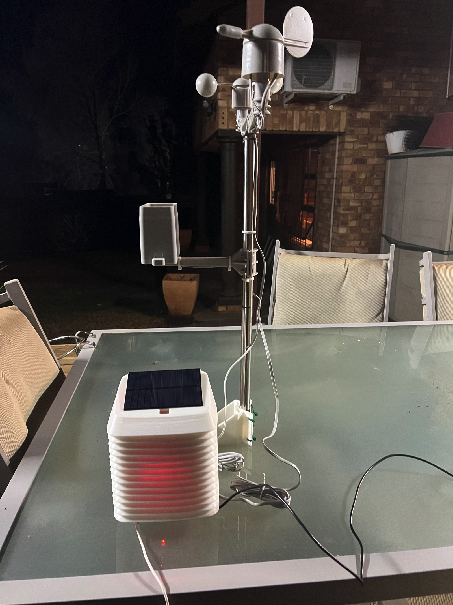
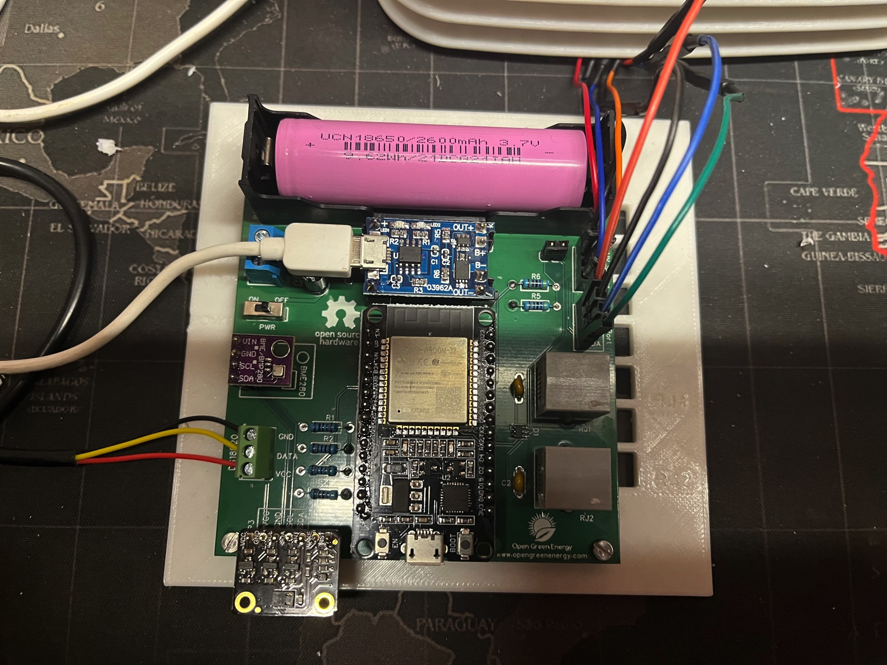
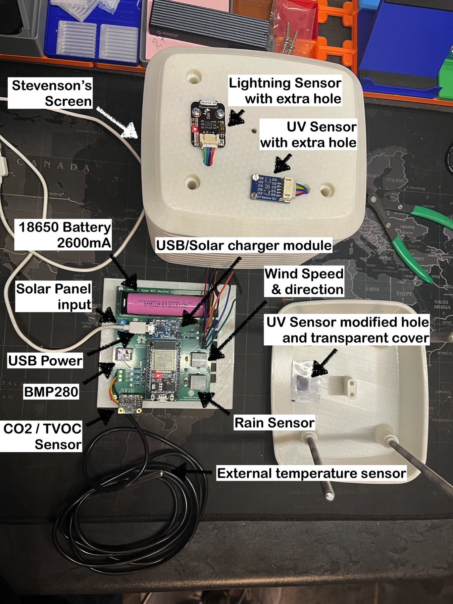
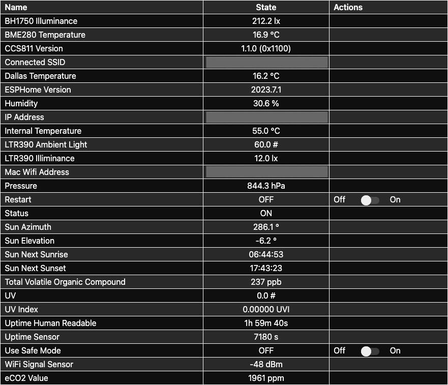

# ESPHome Weather Station 

### Based on Open Energy's Solar Powered WiFi Weather Station V3.0

***Still in active development!***

## Warning!

This example code is supplied **"as is"** with no warranties of any kind, it works on my setup but it des not mean it will work on yours without modifications or at all. This example is meant to point you in the right direction. I take no responsibilities on it's usage. 
I've tried to document it sufficiently that it is readable and easy to understand.

## History

- 2023-08-04 First beta commit.
- 2023-08-23 Beta 2, added Wind Direction, Anemometer (Wind Speed), Rain Gauge, AS3935 Franklin Lightning Detector and  CCS811 Air Quality Control Sensor.

## About the project

I've wanted a weather station for a long time, I am not going to lie, it ain't cheap to build.  
I recently bit the bullet and went ahead, I found something I could partially build myself, my biggest issue was I wanted a PCB and to be honest, I am not the greatest PCB designer, I've done a few simple ones but no more. 

I stumbled on this [article](https://www.instructables.com/Solar-Powered-WiFi-Weather-Station-V30/). It sorted 90% of my hardware issues, so I headed to PCBWay and ordered a board [here](https://www.pcbway.com/project/shareproject/Solar_Powered_WiFi_Weather_Station_V3_0.html)

I will not initially put it to sleep as I it will have a permanent 5v attached to it, I have power on the other side of the wall where it will be installed and a long USB cable to reach it, so the solar panel and battery will be for the occasional power loss, I want to eventually go 100% solar but in due time, probably with a bigger battery and a different solar solution but I got to start somewhere right?

### Some valid questions about the project:

#### Why version 3.2 and not version 3.3 or 4.0?

Version 3 has a **NODEMCU-32 Development Board** as its brains, easily removed and thus maintainable and if needed easily replaceable. Version 3.3 and 4 have the ESP32 soldered to the PCB and require a programmer. I do not mind the programmer, but the ESP32 being soldered to the board is a showstopper for me, besides I do not need the range of LORA or the "Ultra Low Power Consumption" of the version 4. You can find out more on these here:
- [version 3.3](https://www.tindie.com/products/opengreenergy/solar-powered-wifi-weather-station-v33/)
- [version 4](https://www.instructables.com/Solar-Powered-WiFi-Weather-Station-V40/)

## How far am I?

***The state of the weather station***  

I am beyond the prototype now, the PCB arrived from china! Here is what it looks like all connected up.  

I 3D printed most of the Stevenson's Screen in PETG, I am waiting for the new filament to arrive so I can finish.

Here is a labeled overview without the the wind and rain sensors attached.

As you can see, I had to modify the top section to house the LTR390 UV and Ambient Light as well as the AS3935 Lightning Sensor

***The feed from the ESP32*** 

The AS3935 Lightning Sensor is giving me so grief but outside of that I need to do some calibration on the mechanical sensors and it will be ready to be fitted.

### Sensors

The following sensors have been fitted:

- DS18b20 Dallas Temperature Sensor - Temperature (OK)
- BME280 Sensors - Temperature, Humidity & Atmospheric Pressure (OK)
- CCS811 Air Quality Control Sensor - Total Volatile Organic Compound & equivalent CO2 (OK)
- LTR390 UV and Ambient Light Sensor - UV Index & Luminance (OK)
- Wind direction (Needs calibration)
- Wind speed (Needs calibration)
- Rain gauge (needs testing and calibration)
- AS3935 Lightning Sensor (not functional yet)

## The code

You can find the code [here](esphome/weather_station.yaml)

I added a few "virtual" sensors, most notably:
- Beaufort Wind Scale
- Wind Cardinal Direction
- Absolute Humidity
- Dew Point
- Rainfall per minute
- Total daily rain fall

Some of these will be affected by the calibration.
Though the YAML script is in still in development, all the sensors added in it work except the AS3935.

I started on the dashboard as well, see it [here](home%20assistant/README.md)

## What will you need?

The bill of material is on the [Instructables](https://www.instructables.com/Solar-Powered-WiFi-Weather-Station-V30/) page, I've had to swop out a sensor as I could not find an SI1145 UV Index sensor in South Africa. 

It is replaced with a LTR390 UV and Ambient Light Sensor, because of this I was able to remove the BH1750 Light Sensor and free up a I2C port, I had to modify the lid though.

The spare i2c port will allow me to add a CCS811 Air Quality Control Sensor for now, I intend to replace or complement  it with a PMSX003 Particulate Matter Sensor in time.

I am also thinking of adding a rain detector (FY-37) as the Rain Gauge may not fill enough to record a light passing rain, something that happens often where I live. 

I live in a storm prone region, so I added a AS3935 Franklin Lightning Detector, but I have not gotten it to work yet.

As for the Stevenson screen, I printed most of it in white PETG, I am waiting for more PETG, the tolerance are very tight, so be aware.

## What is in the future?

I have various improvements in mind including a partial redesign of the top lid of the Stevenson Screen to house the rain detection sensor and maybe a small camera, an OV5647 or other compatible camera with added sky color detection to evaluate if it is cloudy, partially cloudy or sunny. 

I also want to change the battery and solar setup to something more substantial with battery and solar energy generation monitoring.

But I'll post it all here.

I want to add all of these sensors:
- FY-37 Rain Detector - Rain Detection
- PMSX003 Particulate Matter Sensor
- Anything I may have forgotten

## Sponsoring

 If you like my work and want to support the growth of the project, you can! 

[![Buy Me A Coffee][2]][1]

[1]: https://www.buymeacoffee.com/parentpj
[2]: https://cdn.buymeacoffee.com/buttons/default-black.png

