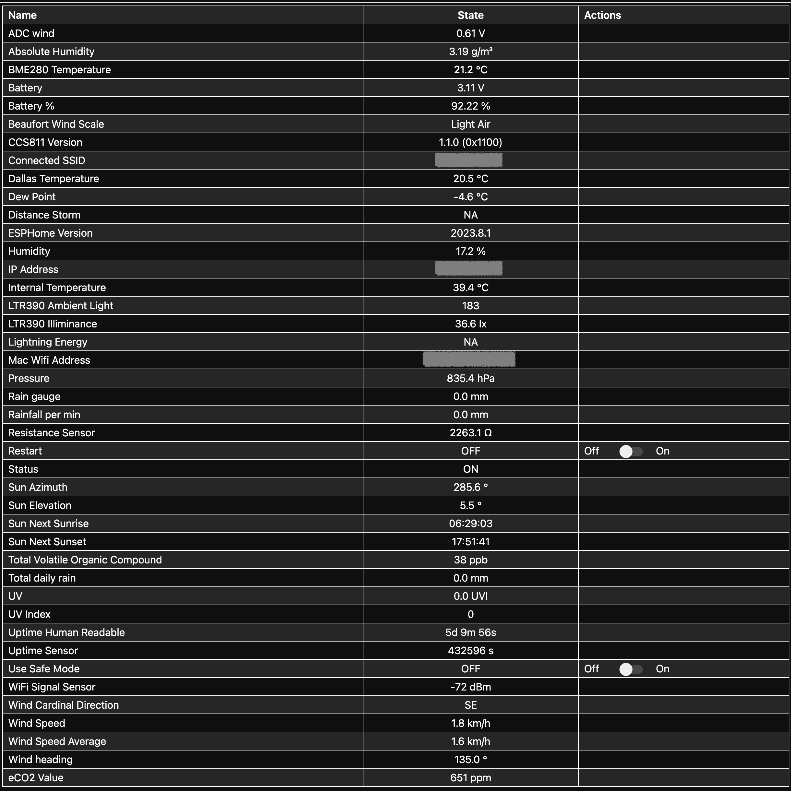

# ESPHome Weather Station 

### Based on Open Energy's Solar Powered WiFi Weather Station V3.0

***Still in active development!***

## Warning!

This example code is supplied **"as is"** with no warranties of any kind, it works on my setup but it des not mean it will work on yours without modifications or at all. This example is meant to point you in the right direction. I take no responsibilities on it's usage. 
I've tried to document it sufficiently that it is readable and easy to understand.

## History

2023-08-04 First beta commit

## About the project

I've wanted a weather station for a long time, I am not going to lie, it ain't cheap to build.
I recently bit the bullet and went ahead, when I found something I could partially build myself, my biggest issue was I wanted a PCB and to be honest, I am not the greatest PCB designer, I've done a few simple ones but no more. 

I stumbled on this [article](https://www.instructables.com/Solar-Powered-WiFi-Weather-Station-V30/).

It sorted 90% of my hardware issues, so I headed to PCBWay and ordered a board [here](https://www.pcbway.com/project/shareproject/Solar_Powered_WiFi_Weather_Station_V3_0.html)

Whilst I wait for the board to arrive, I thought I'd start the ESPHome conversion of the the code, all I needed was the sensors and an ESP32 Dev Bord, I had a spare NODEMCU-32 which is the same as the one for the board.

I will not initially put it to sleep as I it will have a permanent 5v attached to it, I have power on the other side of the wall where it will be installed and a long USB cable to reach it, so the solar panel will be for the occasional power loss, I want to eventually go 100% solar but in due time, probably with a bigger battery and a different solar solution, but I got to start somewhere right?

### Some valid questions about the project:

#### Why version 3.2 and not version 3.3 or 4.0?

Version 3 has a **NODEMCU-32 Development Board** as its brains, easily removed and thus replaceable. Version 3.3 and 4 have the ESP32 soldered to the PCB and require a programmer. I do not mind the programmer, but the ESP32 being soldered to the board is a showstopper for me, besides I do not need the range of LORA or the "Ultra Low Power Consumption" of the version 4. You can find out more on 
- [version 3.3](https://www.tindie.com/products/opengreenergy/solar-powered-wifi-weather-station-v33/)
- [version 4](https://www.instructables.com/Solar-Powered-WiFi-Weather-Station-V40/)

#### Why are you doing this when Digiblur DIY has done it?

That is an easy question to answer, if I copied his YAML, what would I have learned? How would I be able to add or modify any sensors? 

I have not looked at his code at all, I will once I am finished but I am certain that there will be a lot of similarities. You can find his video [here](https://youtu.be/VUqOIPVbeF0)

But please follow him, he may be a strange character but his content is very educational, you can find him [here](https://www.youtube.com/@digiblurDIY/videos)

## Where am I?

***The state of the prototype***

***The feed from the ESP32*** 

The following sensors have been added and tested:

- DS18b20 Dallas Temperature Sensor - Temperature
- BME280 Sensors - Temperature, Humidity & Atmospheric Pressure
- BH1750 Luminance Sensor, *I may remove this this one as the LTR390 gives me the same sensor*
- CCS811 Air Quality Control Sensor - Total Volatile Organic Compound & equivalent CO2
- LTR390 UV and Ambient Light Sensor - UV Index & Luminance

## What will you find here?

***The code***

weather_station.yaml

Currently the YAML script is in early development however, all the sensors added in it work.

## What will you need?

The bill of material is on the Instructables page mentioned above, I've had to adjust a sensor as I could not find an SI1145 UV Index sensor in South Africa. 

I replaced the SI1145 UV Index sensor with a LTR390 UV and Ambient Light Sensor, whether I will keep the BH1750 luminance sensor remains to be seen, it may just be redundant and would give me a spare i2c port on the board. I will unfortunately have to modify the Stevenson Screen top lid to fit it.

The spare i2c port will allow me to add a CCS811 Air Quality Control Sensor for now, I intend to replace or complement  it with a PMSX003 Particulate Matter Sensor in time.

I am also thinking of adding a rain detector (FY-37) as the Rain Gauge may not fill enough to record a light passing rain, something that happens often where I live. 

I live in a storm prone region, so I may add a AS3935 Franklin Lightning Detector too, being i2c this should be trivial.

As for the Stevenson screen, I printed it in white PETG, the tolerance are very tight, so be aware.

## What will be next?

I have various improvements in mind including a partial redesign of the top lid of the Stevenson Screen to house the rain detection sensor and maybe a small camera, OV5647 or other compatible camera with added sky color detection to evaluate if it is cloudy, partially cloudy or sunny. 

Change the battery and solar setup to something more substantial with battery and solar energy generation monitoring.

But I'll post it all here.

### Coming next 

- Wind Direction
- Anemometer - Wind Speed
- Rain Gauge - Rain Amount
- FY-37 Rain Detector - Rain Detection
- AS3935 Franklin Lightning Detector
- PMSX003 Particulate Matter Sensor
- Anything I may have forgotten

## Change log

Coming soon

